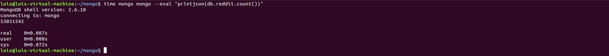
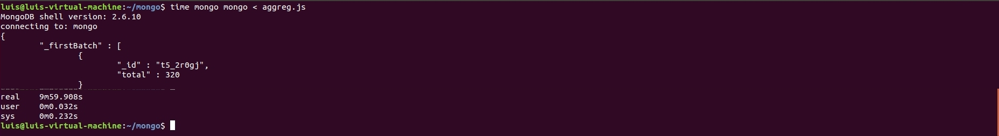

# nosql_egzamin
Projekt zespolowy stworzony na zaliczenie zajec czesci egzaminacyjnej nosql

osoby:
* Micha³ Lipiñski
* Mariusz Pi¹tek

## zalozenie 
Zalozeniem w tym cwiczeniu przeze mnie i Mariusza bylo sprawdzenie jak mongodb bedzie dzialalo w systemie ktory zostal poddany wirtualizacji.
Do testow uzylismy sporej bazy z [reddit](https://www.reddit.com/r/datasets/comments/3bxlg7/i_have_every_publicly_available_reddit_comment), wielkosc ~5,5GB
po rozpakowaniu plik json ~32GB, ilosc rekordow 53 851 542 obiekty.

## dzialania na mongodb (agregacja)

* zliczanie obiektow w mongodb jest natychmiastowe (w dalszej czesci zliczanie na danych psql zajmuje znaczaco wiecej czasu)



* zliczenie wszystkich subredditow - PokemonTreaders widac zajelo juz ~10 min


* podczas dzialan agregujacych czas jest podobny do zliczania i odczytu ~10min



* jak mozna zauwazyc szukanie/zliczanie czy agregacja danych polega na dostepie read do dysku co widac ponizej dobrze na hoscie:
	


* dla VMki powyzsze operacje dociazaja jak widac vCPU ale vRAM pozostaje bez wiekszych zmian.
	


skrypty ktore zostaly uzyte do powyzszych dzialan:

aggreg.js
```js
var dbaggreg = db.reddit.aggregate( [ { $match: { author : "YoungModern" } } , { $group: { _id : "$subreddit_id" , total : { $sum: "$score" } } } ] ).pretty();

printjson(dbaggreg);
```

powyzsza agregacja z uzyciem kodu js:

aggreg2.js
```js
var group = { $group: { _id : "$subreddit_id" , total : { $sum: "$score" } } };
var match = { $match: { author : "YoungModern" } };

var cursor = db.zipcodes.aggregate([
  group,
  match
]).pretty();

cursor.forEach(function(d) {
  printjson(d);
});
```

rowniez powyzsza aggregacja przy uzyciu kodu Python:

aggreg3.py
```py
import pymongo
from pymongo import MongoClient

connection = MongoClient('localhost', 27017)

db = connection.reddit

reddits = db.reddit.aggregate( [ { "$match": { "author" : "YoungModern" } } , { "$group": { "_id": "$subreddit_id" , "total" : { "$sum": "$score" } } } ] ).pretty()

print(list(reddits))
```
