# nosql_zaliczenie
Projekt zespolowy stworzony na zaliczenie zajec czesci laboratoryjnej nosql

osoby:
* Michał Lipiński
* Mariusz Piątek

## zalozenie 
Zalozeniem w tym cwiczeniu przeze mnie i Mariusza bylo sprawdzenie jak mongodb bedzie dzialalo w systemie ktory zostal poddany wirtualizacji.
Do testow uzylismy sporej bazy z [reddit](https://www.reddit.com/r/datasets/comments/3bxlg7/i_have_every_publicly_available_reddit_comment), wielkosc ~5,5GB
po rozpakowaniu plik json ~32GB, ilosc rekordow 53 851 542 obiekty.
tym samym bedziemy badac dwie maszyny:

| struktura fizyczna | struktura zwirtualizowana |
| VMware HOST | VM z mongodb |
|--- | ---|
| sytem: Windows 10 Pro x64 | system: Ubuntu 15.10 x64 |
| RAM: 16GB | RAM: 4GB |
| procesor: AMD FX-8320 (8 core) | procesor: 4 zwirtualizowane procesory |
| dysk: WDC WD20EURX-64 (2TB dysk cache 64MB rotation 7200RPM) | dysk: zwirtualizowany 100GB w pojedynczym pliku vmdk |
| Mongo | 2.6.10 |
| Postgres | 9.4 (Ubuntu repository dla ver. 15.10) |

* VMware HOST (warstwa fizyczna)

  * sytem: Windows 10 Pro x64
  * RAM: 16GB
  * procesor: AMD FX-8320 (8 core)
  * dysk: WDC WD20EURX-64 (2TB dysk cache 64MB rotation 7200RPM)

### struktura zwirtualizowana

* VM z mongodb (warstwa zwirtualizowana)

  * system: Ubuntu 15.10 x64
  * RAM: 4GB
  * procesor: 4 zwirtualizowane procesory
  * dysk: zwirtualizowany 100GB w pojedynczym pliku vmdk

## import do mongodb

* odpalamy baze mongo db z parametrami cpu i directoryperdb w celu sprawdzania uzycia samego silnika w przypadku pierwszego przelacznika, drugi uzyteczny przy importowaniu innych baz w celu zachowania porzadku

```sh
mongod --cpu --directoryperdb --dbpath /home/luis/mongo
```

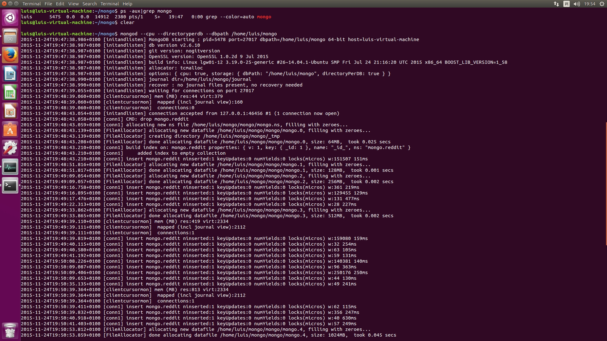

* importujemy baze do mongodb, uzycie binarki time pokazuje czas wykonywania polecenia

```sh
time bunzip2 -c RC_2015-01.bz2 | mongoimport --drop -d mongo -c reddit
```

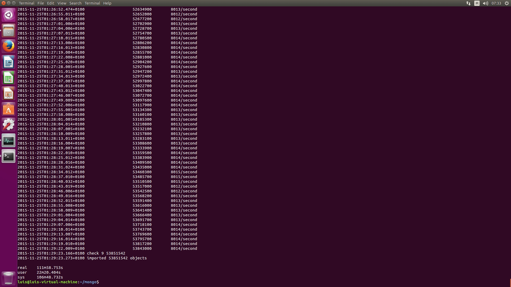

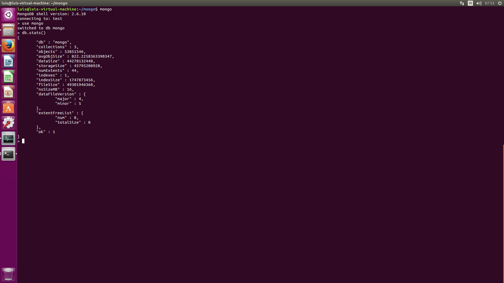

jak widac czas jest blisko 120 minut, a zuzycie procesora dla hosta i VMki podczas importu wyglada jak ponizej:

 * HOST mozemy zauwazyc wzmozona prace 4 corow procesora fizycznego oraz dysku fizycznego dla watku VMki (write okolo 10MB/s)
	
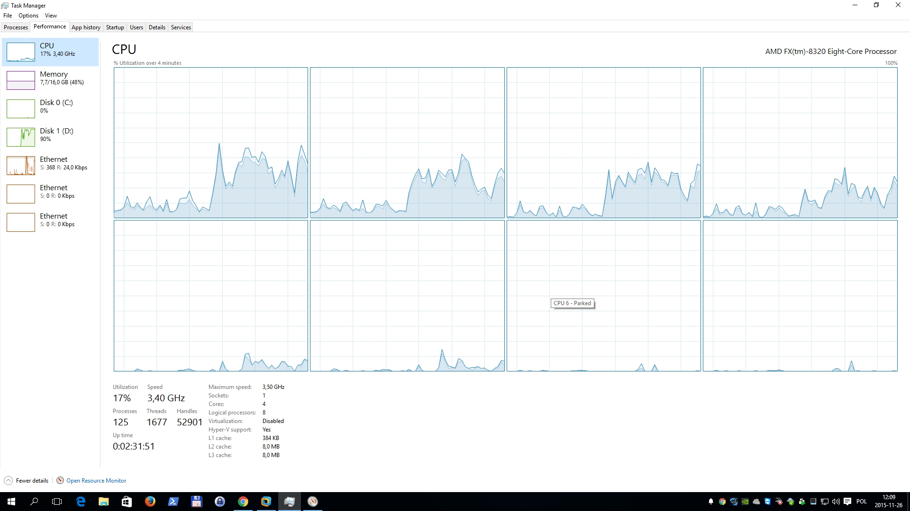

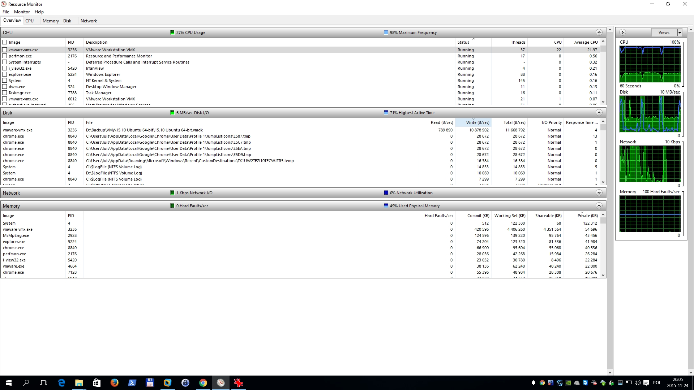

 * VMka
	
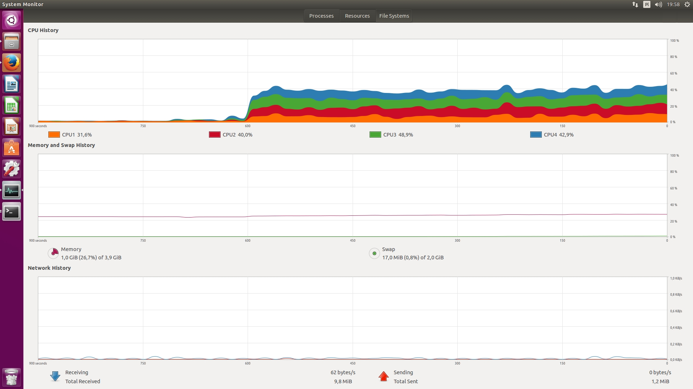

* widac, ze utylizacja hosta jest tylko na 4 core`ach *czyli polowie) i 4 wirtualnych CPU dla VMki czyli 100% przydzielonych zasobow wirtualnych

## dzialania na mongodb (count)(find)(agregacja)

* zliczanie obiektow w mongodb jest natychmiastowe (w dalszej czesci zliczanie na danych psql zajmuje znaczaco wiecej czasu)


* zliczenie wszystkich subredditow - PokemonTreaders widac zajelo juz ~10 min


* podczas dzialan agregujacych czas jest podobny do zliczania i odczytu ~10min


* jak mozna zauwazyc szukanie/zliczanie czy agregacja danych polega na dostepie read do dysku co widac ponizej dobrze na hoscie:
	
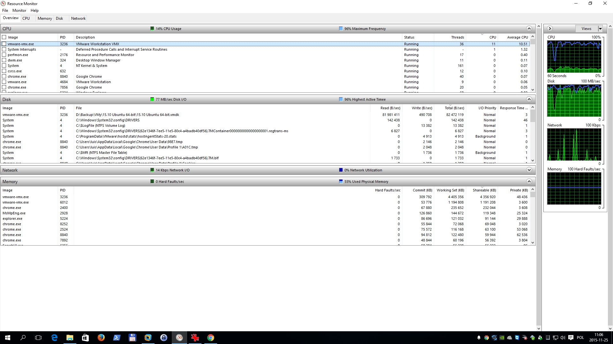

* dla VMki powyzsze operacje dociazaja jak widac vCPU ale vRAM pozostaje bez wiekszych zmian.
	
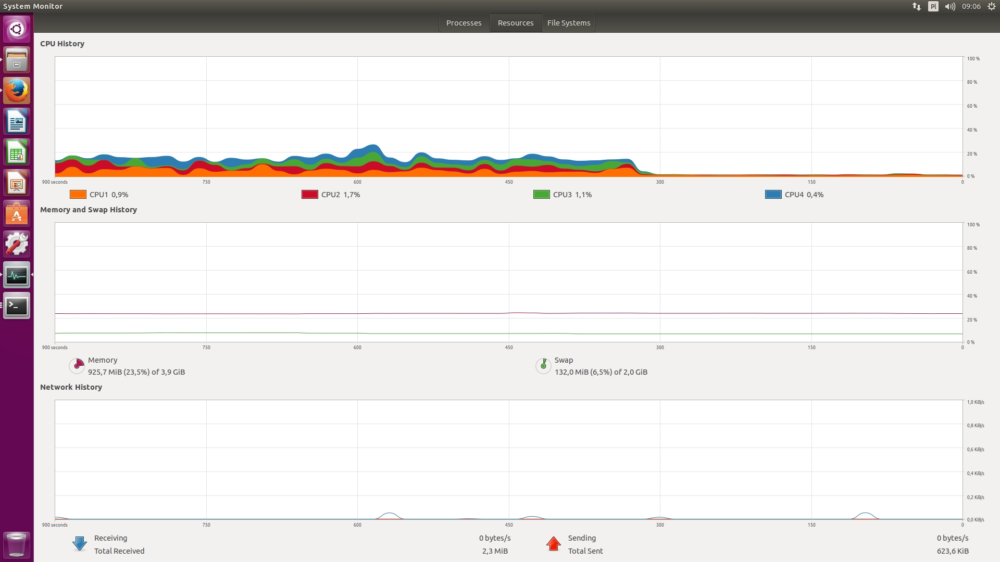

skrypty ktore zostaly uzyte do powyzszych dzialan:

find1.js
```js
var dbfind1 = db.reddit.find({"author":"YoungModern", "score":{$gt: 10}}).count();

printjson(dbfind1);
```

find2.js
```js
var dbfind2 = db.reddit.find().pretty().limit(10);

printjson(dbfind2);
```

aggreg.js
```js
var dbaggreg = db.reddit.aggregate( [ { $match: { author : "YoungModern" } } , { $group: { _id : "$subreddit_id" , total : { $sum: "$score" } } } ] ).pretty();

printjson(dbaggreg);
```

## dzialania na postgres (import) (count)


* importowanie jsona bylo podzielone na dwie czesci, pierwsza to rozpakowanie archiwum z jsonem a druga to import przy pomocy binarki pgfutter, jak widac nie zajelo specjalnie duzo czasu:

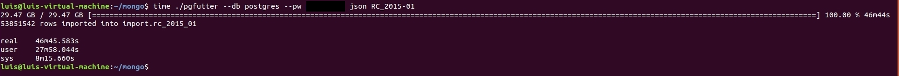

* jednakze zliczanie wszystkich rekordow w bazie postgres juz trwa znaczaco **baaaaardzo dlugo:)**
 * 5050563 ms = 84.17605 min **:)**

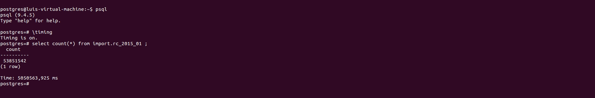

* ponizej mozna zauwazyc ze maszyna fizyczna jak i wirtualna glownie zajete byly "dyskowo"

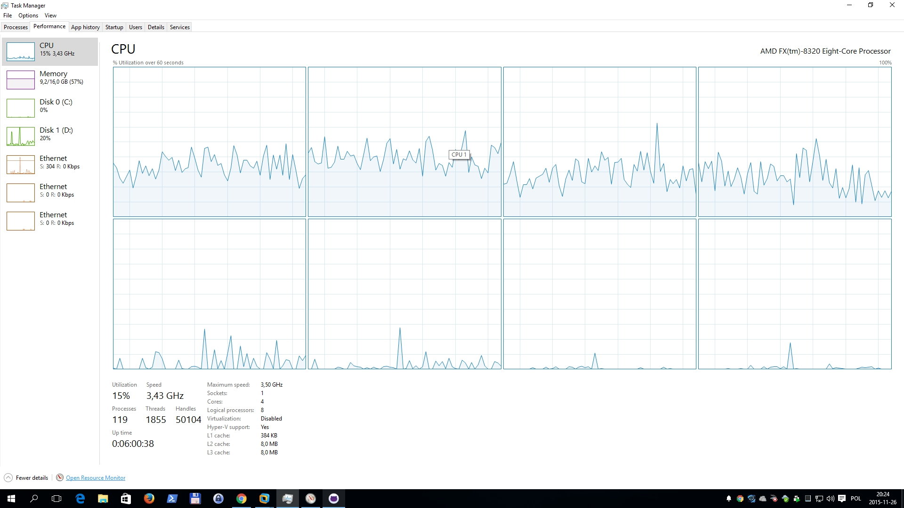

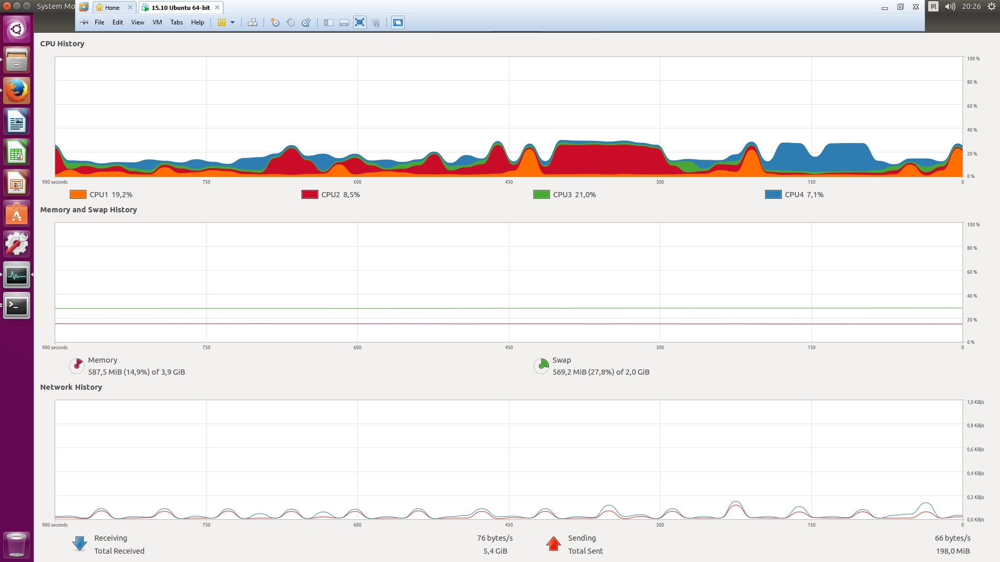

## GEOJSONy - (point) (polygon) (LineString)

* do zabawy z geojsonami uzylismy zbioru wszystkich miast i miasteczek w Polsce (4100 obiekotw) [miasta.polski.json](pliki/miasta.polski.json) gdzie zamiportowanie nie trwalo dlugo:

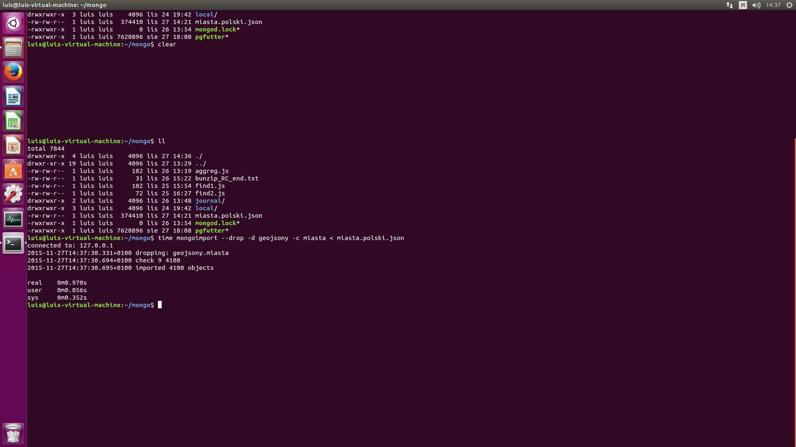

 * wykonanie pierwszego skryptu [geo1.js](pliki/geo1.js) ktorego postac wyglada:
 ```js
 var gdansk = {
    "type" : "Point",
    "coordinates" : [ 18.68976, 54.361118 ]
	};
var geofind = db.miasta.find({loc: {$near: {$geometry: gdansk} } }).skip(1).limit(5).toArray();

printjson(geofind);
```
dostarcza nam mapke z obszarem (polygon) najblizszych miast w/w obszarze:
[geo1.geojson](pliki/geo1.geojson)

* wykonanie drugiego skryptu [geo2.js](pliki/geo2.js) ktorego postac wyglada:
```js
var gdansk = db.miasta.find({"name":"Gdańsk"}).limit(2).toArray()[0]
var gdansk2 = db.miasta.find({"name":"Gdansk"}).limit(1).toArray()[0]
var gdynia = db.miasta.find({"name":"Gdynia"}).limit(1).toArray()[0]
var sopot = db.miasta.find({"name":"Sopot"}).limit(1).toArray()[0]
var rumia = db.miasta.find({"name":"Rumia"}).limit(1).toArray()[0]
var reda = db.miasta.find({"name":"Reda"}).limit(1).toArray()[0]
var puck = db.miasta.find({"name":"Puck"}).limit(1).toArray()[0]
var wladek = db.miasta.find({"name":"Wladyslawowo"}).limit(1).toArray()[0]
var jastarnia = db.miasta.find({"name":"Jastarnia"}).limit(2).toArray()[0]
db.miasta.find({loc: {$geoIntersects: {$geometry : {type: "LineString", "coordinates" : [gdansk.loc.coordinates,gdansk2.loc.coordinates,gdynia.loc.coordinates,sopot.loc.coordinates,rumia.loc.coordinates,reda.loc.coordinates,puck.loc.coordinates,wladek.loc.coordinates,jastarnia.loc.coordinates]}}}})
```

dostarcza nam mapke z droga (LineString), ktora pokonuje na hel jadac na kajta:)
[geo2.geojson](pliki/geo2.geojson)

a tutaj mapka polski (polygon)
[polska.geojson](pliki/polska.geojson)

## __Na koniec taka nasza zyciowa prawda, ktora jak sie okazalo nawet podczas powyzszych zmagan dala sie we znaki:)__

